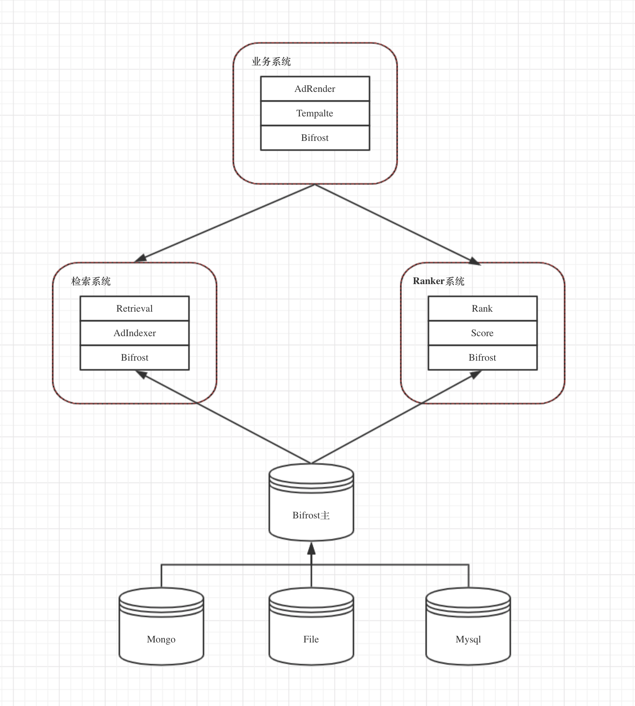
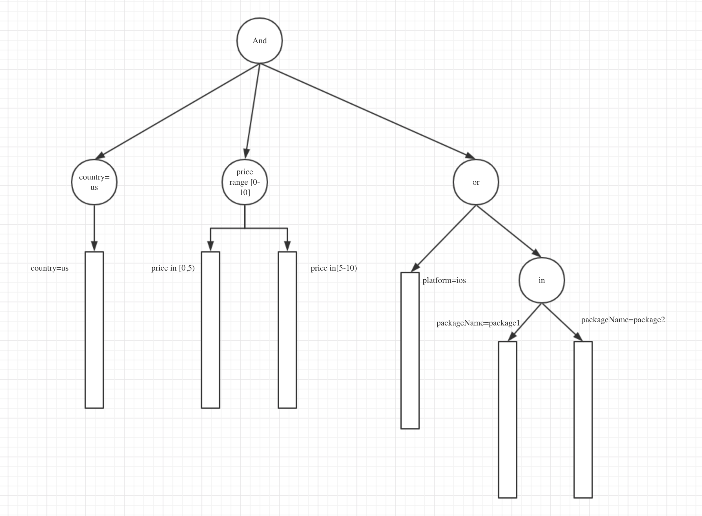

# searcher
golang语言实现的通用的广告检索系统

## 目标

1. 通用性： 能试用广告检索的大部分情况
2. 易用性： 可以极低的代价从0搭建搜索引擎
3. 性能： 本身搜索性能20ms内，单机QPS>1-2K

## 主要特性

### 一、索引

1. 支持倒排索引、正排索引字段
2. 倒排索引支持
   1. 数值型（int, double）
   2. 字符串型
3. 正排索引
   1.  数值型（int, double）
   2. 字符串型
4. 倒排全量索引（10min内），正排实时索引（一期）
5. 索引使用Bifrost中的Container（一期）
6. 缓存机制（需调研）
7. 素材索引（一期不考虑）
8. 检索广告、素材的属性（待考虑，性能堪忧）

### 二、 查询

1. 支持查询，过滤，统计功能

### 三、数据映射

数据映射主要指数据源中的字段与索引字段中的映射关系

1. 支持MongoDb数据映射
2. 支持Socket数据映射（json格式）
3. 支持BifrostStreamer数据同步

## 设计

### 整体架构



### 一、查询

#### 查询语法

查询是类sql语法，有表达式组成（可嵌套），表达式有 and, or, not等操作

支持 =, >=, >, <=,<, !=, range, in

查询语法支持三种格式  string,  json, go stuct

```shell
country=us and (price in [1, 10])
```

```````json
{
    "query": {
        "and": [
            {
                "=": {
                    "field": "country",
                    "value": "US"
                }
            },
            {
                "range": {
                    "field": "price",
                    "value": [
                        1,
                        20
                    ]
                }
            }
        ]
    }
}
```````


```go
// 构建查询
q := NewQuery(NewAndExpress(
  EqExpression("country", EQ, "us"),
  RangeExpression("price", RANGE, 1, 20)
))

// 遍历结果
for q.HasNext() {
  docid := q.Next()
}
```

#### 查询执行过程

1. 构建查询语法树

   

2. 执行语法树

3. 过滤

#### 性能分析

1. 倒排链的数据规模与耗时统计

### 二、索引

#### 倒排索引

倒排索引是一个Key, InvertList结构

* Key： FieldName + Value（一个字符串、一个数值、也可以是一个数值范围）
* InvertList： 是一个有序的集合的接口，，可以是数组、跳表、排序树等
* Value:  一个字符串、一个数值、也可以是一个数值范围

##### 查询接口：

倒排索引可以有不同的实现方式，只要满足下面的接口，都可以称之为倒排索引

```go
// InvertList 倒排结构的接口，仅负责查询，不负责索引更新
type InvertList interface {
	HasNext()
	Next() query.DocId
	GetGE(id query.DocId) query.DocId
}

type InvertIndex interface {
	GetInvertList(fieldName string) InvertList
}
```

##### 更新

倒排索引更新由bifrost streamer负责， 直接使用KList的Container

#### 正排索引

正排分字段存储，结构为map<fieldname, <docid, value>>

#### 查询接口

```go
// 按字段存储正排信息
type StorageIndex interface {
   Get(filedName string, id query.DocId) interface{}
}
```

##### 更新

正排索引更新由bifrost streamer 负责更新，直接使用K-Value型Container

### 三、 数据映射

数据映射有两种方式

1. 由bifrost模块完成,正排、倒排数据格式由对应的Parser接口指定
2. 提供常见数据源的格式， 如mongo/文件/mysql等

Mongo：

```json
{
  "key" : "",
  "index" : {
  	"country" : {"type" : "string", "revert_index" ： 1},
  	"platform" : {"type" : "string", "revert_index" : 1, "storage_index" : 1}
  }
}
```

文件/mysql一期暂不实现

### 四、缓存机制

对于相同的请求（查询树签名一致），会缓存最终结果100条（可配置）

是否启用缓存机制，需要调研请求是否符合局部性原理